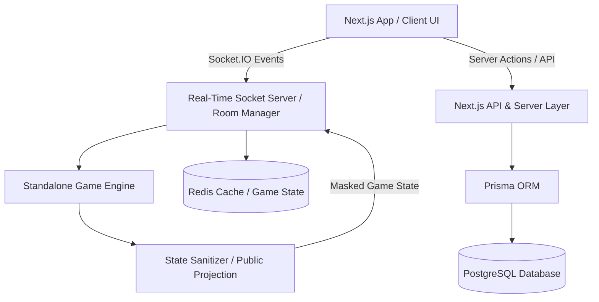

# System Architecture

## Overview

UNO Card Arena is designed using a decoupled, domain-driven architecture that separates the core game engine from transport layers (WebSocket / HTTP) and presentation UI (React / Next.js).

## Directory Structure

- `src/game-engine/`: Pure TypeScript deterministic game simulation without UI or DOM dependencies.
  - `cards/`: Unique card ID generation, standard & custom card factories.
  - `deck/`: Fisher-Yates shuffling, pile drawing, and discard recycling.
  - `rules/`: Playability matching, stacking rules (+2/+4), Jump-In, 7-0 swaps, bluff checks.
  - `turns/`: Turn direction, skipping, and 2-player reverse mechanics.
  - `scoring/`: Official points calculation and ranking tallies.
  - `actions/`: Server-authoritative action processors (`PLAY_CARD`, `DRAW_CARD`, `CALL_UNO`, `CATCH_UNO_FAILURE`, `CHALLENGE_WILD_FOUR`, `JUMP_IN`, etc.).
  - `serialization/`: State masking to ensure opponent hands are hidden from clients.
- `src/components/`: Reusable UI components including SVG/CSS card renderers, platform headers, and navigation.
- `src/stores/`: Zustand client stores for local UI state and game interactions.
- `src/server/`: Socket.IO room manager, matchmaking queues, and session binding.
- `src/db/`: Prisma database client singleton and schema definitions.
- `src/lib/`: Authentication, environment validation, and helper utilities.
- `prisma/`: Prisma schema defining PostgreSQL entities.
- `tests/`: Vitest unit and integration test suite.
