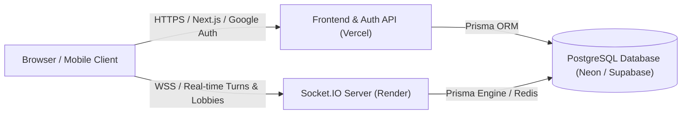

# 🚀 Deployment Guide: Render (Backend) + Vercel (Frontend)

This guide walks you through deploying the **UNO Card Arena** platform:
- **Backend (WebSockets & Real-Time Rooms)** → **Render** Web Service
- **Frontend (Next.js & Auth.js)** → **Vercel** Serverless Hosting
- **Database (PostgreSQL)** → **Neon.tech** or **Supabase** (Free Tier)



---

## 📋 Prerequisites
1. A **GitHub** repository containing this project.
2. A free account on [Neon.tech](https://neon.tech) or [Supabase](https://supabase.com).
3. A free account on [Render.com](https://render.com).
4. A free account on [Vercel.com](https://vercel.com).
5. (Optional) Google OAuth credentials from [Google Cloud Console](https://console.cloud.google.com).

---

## Step 1: Database Setup (Neon or Supabase)

1. Go to [neon.tech](https://neon.tech) and create a free project named `uno-arena`.
2. From the project dashboard, copy:
   - **Pooled connection string** (for `DATABASE_URL`)
   - **Direct connection string** (for `DIRECT_URL`)
3. Run the schema migration locally or against your cloud database:
   ```bash
   npx prisma db push
   ```

---

## Step 2: Deploy Backend to Render

### Option A: Using Render Blueprint (`render.yaml`) — Easiest
1. Go to your [Render Dashboard](https://dashboard.render.com).
2. Click **New +** → **Blueprint**.
3. Connect your GitHub repository.
4. Render will automatically detect `render.yaml` and configure the Web Service with:
   - **Build Command**: `npm install && npm run db:generate`
   - **Start Command**: `npm run server:start`
   - **Health Check Path**: `/health`
5. Under Environment Variables, fill in your `DATABASE_URL`.
6. Click **Apply**.

### Option B: Manual Web Service Setup
1. Click **New +** → **Web Service**.
2. Select your GitHub repository.
3. Configure the following settings:
   - **Name**: `uno-card-arena-backend`
   - **Region**: Oregon (or nearest to your database)
   - **Runtime**: `Node`
   - **Build Command**: `npm install && npm run db:generate`
   - **Start Command**: `npm run server:start`
   - **Health Check Path**: `/health`
4. Add the following **Environment Variables**:
   | Key | Value | Notes |
   | :--- | :--- | :--- |
   | `NODE_ENV` | `production` | Production mode |
   | `PORT` | `10000` | Render default port |
   | `DATABASE_URL` | `postgresql://...` | Your Neon/Supabase PostgreSQL connection string |
   | `CORS_ORIGIN` | `*` *(or your Vercel URL later)* | Allowed frontend origins |
5. Click **Create Web Service**.
6. Once deployed, copy your Render service URL (e.g. `https://uno-card-arena-backend.onrender.com`).

---

## Step 3: Deploy Frontend to Vercel

1. Go to your [Vercel Dashboard](https://vercel.com).
2. Click **Add New...** → **Project**.
3. Import your GitHub repository.
4. Framework Preset will be automatically detected as **Next.js**.
5. Add the following **Environment Variables** in Vercel:

| Variable | Value | Description |
| :--- | :--- | :--- |
| `DATABASE_URL` | `postgresql://...` | Your PostgreSQL connection string |
| `DIRECT_URL` | `postgresql://...` | Direct non-pooled PostgreSQL URL |
| `NEXTAUTH_SECRET` | *(Random 32+ char key)* | Generate via `openssl rand -base64 32` |
| `AUTH_SECRET` | *(Same as NEXTAUTH_SECRET)* | Alias for Auth.js |
| `NEXTAUTH_URL` | `https://your-project.vercel.app` | Your Vercel deployment domain |
| `NEXT_PUBLIC_APP_URL` | `https://your-project.vercel.app` | Public frontend URL |
| `NEXT_PUBLIC_SOCKET_SERVER_URL` | `https://uno-card-arena-backend.onrender.com` | **Your Render backend URL from Step 2** |
| `GOOGLE_CLIENT_ID` | `your-id.apps.googleusercontent.com` | Google OAuth Client ID |
| `GOOGLE_CLIENT_SECRET` | `GOCSPX-your-secret` | Google OAuth Client Secret |

6. Click **Deploy**.
7. Once deployed, your frontend will be live at `https://your-project.vercel.app`.

---

## Step 4: Finalize CORS & Google OAuth

### 1. Update Render CORS
In your **Render Dashboard** → **uno-card-arena-backend** → **Environment**:
- Update `CORS_ORIGIN`:
  ```env
  CORS_ORIGIN="https://your-project.vercel.app,http://localhost:3000"
  ```
- Save changes to trigger a zero-downtime redeploy.

### 2. Update Google Cloud Console
In [Google Cloud Console](https://console.cloud.google.com) → **Credentials** → Your OAuth Client:
- **Authorized JavaScript origins**:
  - `https://your-project.vercel.app`
  - `http://localhost:3000`
- **Authorized redirect URIs**:
  - `https://your-project.vercel.app/api/auth/callback/google`
  - `http://localhost:3000/api/auth/callback/google`
- Click **Save**.

---

## 🧪 Post-Deployment Verification Checklist

- [ ] **Health Check**: Visit `https://your-backend.onrender.com/health` → should return `{"status":"ok", "service":"uno-multiplayer-backend"}`.
- [ ] **Google Sign-In**: Click "Sign In" on `https://your-project.vercel.app/login` → successfully logs in and shows your avatar in Header.
- [ ] **Real-Time Rooms**: Create a room on `/rooms` → open room link in another browser window or incognito → verify real-time lobby slot sync and game launch.
- [ ] **Tournaments & Store**: Browse `/tournaments`, `/store`, and `/clubs` to ensure zero 404s and real-time state persistence.
